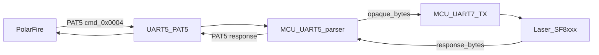
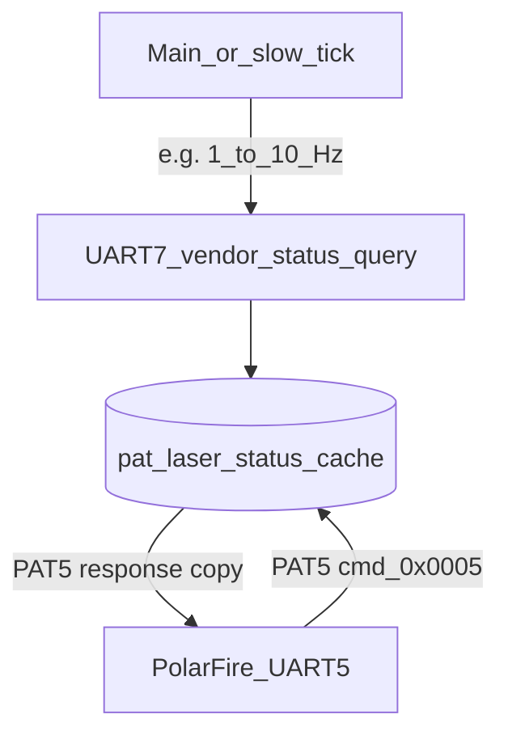

# UART5 payload design — PolarFire ↔ acquisition MCU

This document specifies the **binary container** for commands and telemetry on **UART5** (**PC12** TX / **PD2** RX on the MCU HAT **J2** stack wiring — see [PINMAP.md](../PINMAP.md)). The framing is now implemented in **`pat_nucleo_mems_bringup`** (`src/pat_uart5_pat5.c` + `src/main_mems_bringup.c`); keep this spec as the normative transport contract for PolarFire RTL/software. **§2.3** specifies how the MCU recognises a **complete** frame and the recommended **parser → dispatcher** split.

**Related:** [SPI6_HOST_MANUAL.md](SPI6_HOST_MANUAL.md) (high-throughput **64 B** SPI slave export), [UART7_LASER_DRIVER.md](UART7_LASER_DRIVER.md) (laser **UART7** vendor framing), [AGENTS.md](../AGENTS.md). **UART5** is the **low-latency command / status** path; **SPI6** remains the **bulk** numeric export when enabled.

---

## 1. Link assumptions

| Parameter | Value | Notes |
|-----------|--------|--------|
| Baud | **921600** 8N1 | Stack default in **02b1-mcu-pinmap**; confirm on hardware. |
| Direction | **Full-duplex** | PolarFire **TX** → MCU **RX** (**PD2**); MCU **TX** → PolarFire **RX** (**PC12**). |
| Flow control | **None** in v1 | Optional **RTS/CTS** in a later revision if overruns occur. |
| Endianness | **Little-endian** | All multi-byte integers **LE**, consistent with SPI6 rolling (`fmt 0x0A`). |

---

## 2. Frame container (version 1)

Every logical message is one **frame**. Frames are **not** newline-terminated; framing uses **magic**, **length**, and **CRC-32**.

### 2.1 Layout

| Offset | Size | Field | Description |
|-------:|-----:|--------|-------------|
| 0 | 4 | `magic` | Constant **`PAT5`** → bytes **`50 41 54 35`** hex (`0x50,'P' … '5'`). |
| 4 | 1 | `ver` | Protocol **major** only for this document (**`0x01`**). |
| 5 | 1 | `flags` | See §2.2. |
| 6 | 2 | `seq` | **uint16_t** **LE** — transaction id; **echo** in the paired response. |
| 8 | 2 | `cmd` | **uint16_t** **LE** — command or event id (§3). |
| 10 | 2 | `len` | **uint16_t** **LE** — byte length of **`payload`** only (**0 … 504** in v1). |
| 12 | `len` | `payload` | Opaque to transport; interpreted by **`cmd`** (§4). |
| 12+`len` | 4 | `crc32` | **uint32_t** **LE** — CRC-32 **IEEE 802.3** (poly **0xEDB88320**, init **0xFFFFFFFF**, **no** reflection tricks beyond standard — match **`crc32()`** in PolarFire soft). Computed over **bytes [0 .. 11+len]** (i.e. **magic through end of payload**). |

**Maximum wire length:** **12 + 504 + 4 = 520** bytes for v1 (**`len` ≤ 504** keeps the frame under a reasonable single DMA buffer and leaves headroom).

### 2.2 `flags` (byte at offset 5)

| Bit | Name | Meaning |
|-----|------|---------|
| 0 | `DIR` | **`0`** = **host → MCU** (PolarFire issued command). **`1`** = **MCU → host** (response or **unsolicited event**). |
| 1 | `ACK` | **`1`** = this frame **acks** the **`seq`** of the **previous** host command (response path). **`0`** for requests and for **async events** that are not tied to a prior **`seq`**. |
| 2 | `ERR` | **`1`** = **`payload`** carries **error info** (§4.3) instead of success body. |
| 3–7 | — | **Reserved** — send **0**. |

**Pairing rule:** For a **command** **`cmd_req`** with **`seq = N`**, the MCU responds with **`DIR=1`**, **`ACK=1`**, **`seq = N`**, **`cmd`** either **`cmd_req`** (same opcode with response body) or a dedicated **`RSP_*`** opcode — pick one scheme per opcode family and document in §3.

### 2.3 MCU receive — frame completeness and transport parser

The UART hardware does **not** deliver a “packet ready” signal for this protocol. The MCU decides a frame is **complete** and **valid** as follows.

**Authoritative rule (length + CRC):**

1. Maintain a **byte stream buffer** (ring or linear + wrap), fed by **RX** (byte IRQ, **UART IDLE** + DMA circular, or **RXNE** batching — see §7).
2. **Resynchronise** when not locked: scan for contiguous **`PAT5`** magic (**§2.1** offset 0).
3. When **≥ 12** bytes are available starting at a candidate sync, read **`len`** at offset **10** (**LE**). If **`len` > 504** (v1), discard one byte and **resync** (or skip forward) — **do not** wait for more data indefinitely.
4. A frame is **byte-complete** when **≥ 12 + `len` + 4** bytes are present for that candidate.
5. Compute **CRC-32** over bytes **[0 … 11 + `len`]** inclusive; compare to the **four** CRC bytes at the end. **Match** → accept; **mismatch** → discard frame, increment fault counter, **resync**.

**Optional timing hint (not sufficient alone):** **UART IDLE** (line idle for one character time after the last stop bit) or **receiver timeout (RTO)** may be used to **run** the parser when the host has paused, and to recover after garbage. **IDLE alone** does not prove one PAT5 frame if two frames are sent back-to-back with no inter-frame gap; **length + CRC** remain mandatory.

**Recommended software shape (two layers):**

| Layer | Role |
|-------|------|
| **Transport parser** | Consumes raw bytes; outputs **decoded frames**: **`magic`**, **`ver`**, **`flags`**, **`seq`**, **`cmd`**, **`len`**, **`payload`** (pointer into ring or small inline copy), **`crc_ok`**. No MEMS vs acquisition knowledge. |
| **Command dispatcher** | Takes a **valid** decoded frame; branches on **`cmd`** (§3), updates **`pat_mems_reg_block`** / **`pat_mems_sm`** / acquisition structs, and builds **TX** responses per **`seq`** / **`flags`**. |

Parsed commands may be passed to the dispatcher via a **bounded queue** (ISR pushes handle or small struct, **main** pops) so **RX** stays short and quartet-friendly.

---

## 3. Command / event IDs (`cmd`)

Namespaces (high byte):

| `cmd` range | Owner | Purpose |
|-------------|--------|---------|
| **0x0000–0x00FF** | System | Transport (**PING**, **VERSION**, **RESET**, **NACK**). |
| **0x0100–0x01FF** | Acquisition | ADS127 / quartet shadow, **epoch** counters, **fault** masks. |
| **0x0200–0x02FF** | MEMS / DAC | Four **u16** codes, **FCLK** / enable (**when SPI5 path exists**). |
| **0x0300–0x03FF** | Monitoring | **I²C** fibre-intensity cache, **health** ticks. |
| **0x8000–0xFFFF** | Events | **MCU → host only** — **`DIR=1`**, **`ACK=0`** unless piggybacking. |

**Reserved system opcodes (illustrative — wire these first in bring-up):**

| `cmd` | Name | Direction | Payload summary |
|-------|------|-----------|-----------------|
| **0x0001** | `PING` | H→M | empty — MCU responds **`PONG`** same **`seq`**. |
| **0x0002** | `GET_VERSION` | H→M | empty — **`payload`**: **`fw_git`**, **`abi`** (TLV or fixed struct §4). |
| **0x0003** | `GET_STATUS` | H→M | empty — uptime, **last_epoch_ok**, **SPI** fault flags. |
| **0x0004** | `LASER_UART7_BYPASS` | H→M | **Tunnel** — see **§8**. PolarFire embeds **opaque laser-driver bytes**; MCU forwards them **unchanged** to **UART7** after PAT5 decode, then returns laser RX data in the **PAT5** response body. |
| **0x0005** | `GET_LASER_STATUS` | H→M | **Cached snapshot** — see **§9**. Request **`len=0`**; MCU responds from **RAM only** (no **UART7** round-trip on the hot path). |

Product-specific opcodes are allocated from the bands above and tracked in the same table as firmware evolves.

---

## 4. Payload interiors (informative)

### 4.1 TLV option (nested)

For extensibility, **`payload`** may be a sequence of **TLVs**:

| Field | Size |
|-------|------|
| `tag` | **uint16_t** **LE** |
| `tlen` | **uint16_t** **LE** |
| `value` | **`tlen`** bytes |

Multiple TLVs may be concatenated until **`len`** bytes consumed. Unknown **`tag`** → ignore on RX.

### 4.2 Fixed structs (alternative)

Small responses can use a **packed struct** with **`_Static_assert`** in firmware — document **offsets** here when frozen.

### 4.3 Error envelope

When **`flags.ERR=1`**, **`payload`** v1 suggestion:

| Offset | Size | Field |
|-------:|-----:|--------|
| 0 | 2 | `err_code` **LE** |
| 2 | 2 | `origin_cmd` **LE** — which command failed |
| 4 | 2 | `detail_len` |
| 6 | **n** | optional ASCII / binary detail |

---

## 5. Ordering and unsolicited traffic

1. **Host → MCU:** PolarFire may send **commands** anytime; MCU **queues** or processes **in order** if multiple frames arrive back-to-back (FIFO depth **TBD**).
2. **MCU → host:** **Responses** reuse **`seq`**. **Events** (**0x8xxx**) use **`seq`** independently (monotonic **MCU-side** counter **recommended**) or **`seq=0`** if fire-and-forget — **PolarFire** must accept **interleaved** responses and events.
3. **Rate:** Do not exceed sustained **bandwidth** that starves **SPI6** preparation or quartet **epoch** paths — profile on target.

---

## 6. Relationship to SPI6

| Topic | UART5 | SPI6 |
|-------|-------|------|
| **Throughput** | Moderate (command-sized frames). | High (**64 B** bursts, master-paced). |
| **Role** | **Control**, **configuration**, **alarms**. | **Measurement stream** (rolling **`0x0A`**, QPD **`0x02`**, …). |
| **Sync** | **`seq`** pairs request/response. | **`epoch_seq`** inside payload ([SPI6 §5](SPI6_HOST_MANUAL.md)). |

PolarFire **application logic** should treat **UART5** as authoritative for **mode changes** and **SPI6** as authoritative for **sample-aligned** bulk data.

---

## 7. Implementation checklist (firmware)

- [ ] **`MX_UART5_Init`** — **921600**, **8N1**, FIFO **if available**.
- [ ] RX path: **IDLE line** IRQ + DMA **or** byte IRQ feeding a **ring buffer**; **transport parser** per **§2.3** (`PAT5` sync → **`12+len+4`** → CRC) outputs **decoded commands** to a **dispatcher** (bounded queue ISR → main).
- [ ] CRC-32 verify **before** dispatcher runs; drop bad frames + optional **`ERR`** / **`crc_fail`** counter.
- [ ] TX path: build frame, CRC, **`HAL_UART_Transmit`** / DMA.
- [ ] NVIC: **§7.1** — **`UART5_IRQn`** (and any UART5 DMA IRQ) must **not** pre-empt **`SPI1_IRQn`…`SPI4_IRQn`** or **`SPI6_IRQn`**; keep UART5 ISR **minimal** (FIFO → ring); heavy work in **main** when acquisition ISRs are idle.
- [ ] **`MX_UART7_Init`** at laser manual **baud**; **`LASER_UART7_BYPASS` (§8)** path: forward **`opaque`** to **UART7** TX, read response with agreed timeout / IDLE rule, build PAT5 reply on **UART5** TX; **prefer** **DMA + IDLE** RX and **vendor parser** in **main** ([UART7_LASER_DRIVER.md](UART7_LASER_DRIVER.md)); **DMAMUX** stream unique vs other DMA users; **D-cache** invalidate or non-cacheable RX buffer.
- [ ] **§9** — slow **main**-time (or **≥ 1 s** tick) **UART7** status poll: vendor status query → update **`pat_laser_status_cache`**; **`GET_LASER_STATUS` (0x0005)** returns that struct over **UART5** without talking to the laser.

### 7.1 NVIC tiering (same policy as MEMS / SPI5 plan)

**Goal:** **SPI1–SPI4** (ADS127 / quartet) and **SPI6** (J2 slave export) are the **highest-priority** peripherals in the firmware image. **UART5**, **SPI5** (MEMS), **I²C**, and other control paths use **looser** preemption so they run **when SPI ISRs are not active** (or in **main** after queued events).

On STM32H7 **Cortex-M7**, **lower numeric preemption priority** usually means **higher** urgency (verify **`__NVIC_PRIO_BITS`** and Cube/HAL grouping for your build). Match the concrete numbers to [PINMAP.md](../PINMAP.md) **NVIC order** and tune with a logic analyser / DWT if **SPI6** completion jitter affects **SPI1–4** or vice versa.

---

## 8. UART7 laser bypass — PolarFire → UART5 → MCU → UART7

**Goal:** PolarFire issues **laser-native** commands that are **not** PAT5 on the wire to the laser. Only the **MCU ↔ PolarFire** link uses **PAT5** + CRC. The MCU **bypasses** (transparently forwards) the **inner payload** to **UART7** at the **baud and framing** required by the [SF8xxx TO56B manual](UART7_LASER_DRIVER.md).

### 8.1 Request payload (`cmd = 0x0004`, host → MCU)

All multi-byte fields **LE** unless the **inner** laser protocol specifies otherwise (the inner bytes are **opaque** — do not byte-swap inside the tunnel).

| Offset | Size | Field | Description |
|-------:|-----:|--------|-------------|
| 0 | 2 | `inner_len` | Byte count **`N`** of the laser payload that follows (**`N` ≤ `len` − 2`** and **`N` ≤ 502** so the PAT5 `payload` still fits **v1** `len` ≤ 504). |
| 2 | **`N`** | `opaque` | **Raw** bytes PolarFire would have sent on a **direct** UART to the laser — **no** PAT5 header, **no** CRC from this document inside **`opaque`**. |

**MCU behaviour (normative):**

1. After PAT5 **CRC OK**, validate **`inner_len` + 2 ≤ len`** and **`inner_len` ≤ 502** (or product cap from laser max frame).
2. **Transmit** exactly **`opaque[0 … N−1]`** on **UART7** at the laser’s configured **baud** (see [UART7_LASER_DRIVER.md](UART7_LASER_DRIVER.md)) — **IT**, **blocking**, or **DMA** TX per product; if **DMA**, apply **D-cache** rules in that doc.
3. **Receive** laser reply: policy is **product-defined** — e.g. **blocking** **`HAL_UART_Receive`** until **UART7 IDLE**, **`N_rx` ≤ 502** bytes, or **DWT** timeout **`T_laser_rsp_us`**; **recommended** production path: **DMA + IDLE** (or **`ReceiveToIdle_DMA`**) feeding the **vendor parser** in **main** ([UART7 doc — DMA + vendor parser](UART7_LASER_DRIVER.md)). Document the chosen rule in firmware `pat_uart7_bridge.h`.
4. Build **MCU → PolarFire** PAT5 response: **`DIR=1`**, **`ACK=1`**, same **`seq`**, **`cmd=0x0004`**, **`len = 2 + R`**, payload **`uart7_rx_len`** (**`uint16_t` LE**) + **`R`** bytes from step 3.

### 8.2 Errors

If **UART7** TX/RX fails or times out, respond with **`flags.ERR=1`** and **`err_code`** indicating bridge fault (**§4.3**); **`origin_cmd = 0x0004`**.

### 8.3 Ordering and bus gate

- **UART5** PAT5 parser and **UART7** bridge (including **DMA** completion / **IDLE** callbacks) share **tier-C** CPU time — use a **bus gate** or **command queue** so a long **laser** exchange does not stall other **`cmd`** handling if that is unacceptable for the product.
- **Do not** call **`HAL_UART_Transmit`**, **`HAL_UART_Receive`**, or heavy **vendor parsing** on **UART7** from **SPI1–4 or SPI6** ISRs — keep **UART7** IRQ + **DMA** IRQ bodies **thin** ([UART7 doc](UART7_LASER_DRIVER.md)).

---

## 9. Laser status — background **UART7** read, **UART5** on demand

**Goal:** The MCU **periodically** (low rate — **not** tied to quartet **epoch** or **SPI6**) queries the laser on **UART7** using the **vendor status** sequence from the [SF8xxx manual](UART7_LASER_DRIVER.md), stores the reply in **RAM**, and when PolarFire sends **`GET_LASER_STATUS` (`cmd = 0x0005`)**, the MCU answers **from the cache** only. PolarFire **does not** need a high poll rate on **UART5**; the cache may be **seconds** old if that matches the product.

### 9.1 Host → MCU request

| Field | Value |
|-------|--------|
| **`cmd`** | **`0x0005`** |
| **`len`** | **`0`** (empty **`payload`**) |

**Normative:** Handling **`0x0005`** must **not** block on a new **UART7** transaction in v1 — copy **only** from **`pat_laser_status_cache`** (or return **`ERR`** if no successful poll since boot). Optional later extension: a flag in **`payload`** to **force** an immediate **UART7** refresh (document separately if added).

### 9.2 MCU → host response payload (illustrative fixed layout)

All fields **LE**. Cap **`status_len`** so **`8 + status_len` ≤ 504** (e.g. **`status_len` ≤ 496**).

| Offset | Size | Field | Description |
|-------:|-----:|--------|-------------|
| 0 | 4 | `last_poll_ms` | **`HAL_GetTick()`** (or DWT ms) when the **last** successful **UART7** status exchange **finished**. |
| 4 | 2 | `status_len` | **`S`** — byte length of **`status_blob`** (**`0`** if never valid). |
| 6 | 2 | `cache_flags` | **Bit 0** — **`1`** = **`status_blob`** is valid. **Bit 1** — **`1`** = last background poll **failed** (timeout / CRC per vendor). Other bits **reserved** — send **0**. |
| 8 | **`S`** | `status_blob` | **Opaque** copy of the laser’s last status reply (**vendor format**). |

If **`cache_flags` bit 0 = 0**, PolarFire should treat **`status_blob`** as **absent** or **stale**; **`last_poll_ms`** may still advance when polls fail (product choice — document in firmware).

### 9.3 Background poll rate

Choose a fixed interval **`T_laser_poll_ms`** (e.g. **1000**–**10000**) or run the poll only when **main** is idle after quartet work — **profile** so **UART7** activity never competes with **SPI1–4** / **SPI6** deadlines. The **same** **bus gate** as **§8.3** must serialise **UART7** if **bypass** and **status poll** (or **DMA** half-buffer commits) can overlap. **Background** status capture should use the same **DMA + vendor parser** path as **§8** when implemented ([UART7 doc](UART7_LASER_DRIVER.md)).

---

## Document history

| Rev | Date | Change |
|-----|------|--------|
| 1 | 2026-04-26 | Initial v1 container + opcode bands + SPI6 cross-reference. |
| 2 | 2026-04-26 | §2.3 MCU RX: length+CRC frame complete; transport parser vs dispatcher; §7 checklist aligned. |
| 3 | 2026-04-26 | §7.1 NVIC tiering: SPI1–4 + SPI6 highest; UART5 below; cross-reference PINMAP. |
| 4 | 2026-04-26 | §8 `LASER_UART7_BYPASS` (0x0004); UART7 doc link; UART7 checklist item. |
| 5 | 2026-04-26 | §9 cached laser status (`GET_LASER_STATUS` 0x0005); background UART7 poll vs on-demand UART5. |
| 6 | 2026-04-26 | §8 UART7 DMA + vendor parser option; §8.3 bus gate; §7 checklist DMA/D-cache; §9.3 bus gate + UART7 doc link. |
