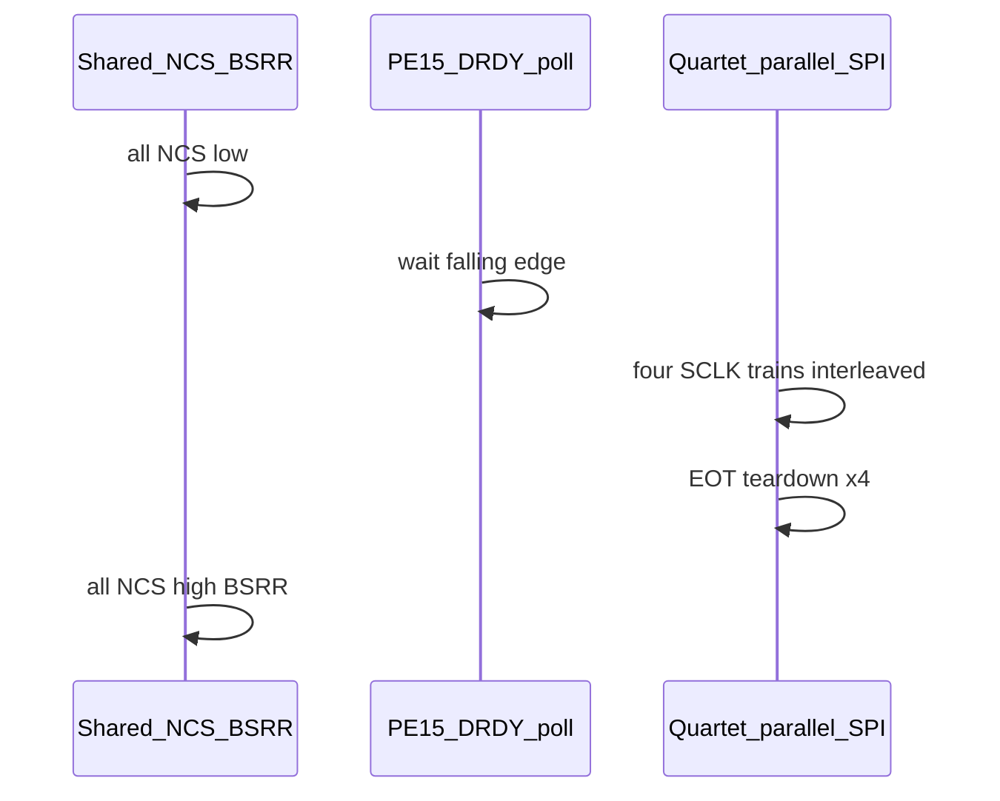

# Quartet — SPI / !CS timing (logic analyser)

Firmware target: **`pat_nucleo_quartet`**. Broader bring-up, J1 routing, and UART/LA cheat sheet: [README.md](README.md). This file focuses **only** on the **quartet sample epoch**: shared **!CS**, four **SCLK** lines, **SCLK → !CS** delay, and how that maps to [`read_quartet_blocking_parallel`](../../src/ads127l11.c) + [`pat_spi_h7_quartet_parallel_txrx_zero3_from_hspi`](../../src/pat_spi_h7_master.c).

**Scope:** quartet epoch as above. **Out of scope:** [`spi_x_ch`](../../src/ads127l11.c) / `delay_short()` (register RREG/WREG path — separate concern).

**Codebase impact:** no required firmware change for the behaviour described here; optional **DWT** instrumentation if you want to quantify the ~6 µs window.

**Key source anchors**

- [`pat_spi_h7_master.c`](../../src/pat_spi_h7_master.c) — `pat_spi_h7_quartet_parallel_txrx_zero3_from_hspi` (interleaved SPI, phases 0→1→2, EOT teardown, `__NOP` on idle pass).
- [`ads127l11.c`](../../src/ads127l11.c) — `read_quartet_blocking_parallel`, `quartet_ncs_all_assert_bsrr` / `quartet_ncs_all_deassert_bsrr`.
- [`pat_spi_ads127.c`](../../src/pat_spi_ads127.c) — `pat_spi_ads127_prescaler_for_instance` (SPI4 vs SPI1–3 baud).

---

## Executive summary

- **!CS is GPIO** on the MCU; SPI does not deassert it. After the last SCLK of the **quartet sample phase**, firmware runs **EOT + disable / TSIZE cleanup** for **each** of the four SPI masters inside `pat_spi_h7_quartet_parallel_txrx_zero3_from_hspi` (default `PAT_QUARTET_PARALLEL_SPI_REGISTER_MASTER=ON`), then `read_quartet_blocking_parallel` calls **`quartet_ncs_all_deassert_bsrr()`** — **no** busy-wait between that function’s return and BSRR; **then** copies `gq_spi_rx` → `out24` ([`ads127l11.c`](../../src/ads127l11.c) lines 1053–1061).
- **Quartet epoch does not use `delay_short()`** (that helper is only on the **`spi_x_ch`** path in the same file).
- **Default sample mode:** four SPI masters **armed together**, **round-robin** service in `pat_spi_h7_quartet_parallel_txrx_zero3_from_hspi`; **good LA** = four SCLK trains **end close together** under shared !CS (§2.2).
- **`~6 µs` SCLK → !CS:** **(A)** if the probe is **one** SCLK vs **shared !CS**, the gap can include **other buses still clocking** (§2.1); **(B)** if **all four SCLK** end **aligned**, residual time is **EOT + teardown × four + any EOT / `__NOP` spin** inside the parallel routine, then BSRR — **not `delay_short`** (§2.3).

---

## 1. Quartet target and epoch path

**Executable:** `pat_nucleo_quartet` in [CMakeLists.txt](../../CMakeLists.txt) — [main_quartet.c](../../src/main_quartet.c), [pat_quartet_epoch.c](../../src/pat_quartet_epoch.c), [pat_quartet_app.c](../../src/pat_quartet_app.c), [pat_quartet_spi_irq.c](../../src/pat_quartet_spi_irq.c), [ads127l11.c](../../src/ads127l11.c), [pat_spi_h7_master.c](../../src/pat_spi_h7_master.c), [pat_spi_ads127.c](../../src/pat_spi_ads127.c).

**Epoch hot path:** `ads127_read_quartet_blocking` → `read_quartet_blocking_parallel`: `quartet_ncs_all_assert_bsrr` → `delay_after_cs_100ns` → DWT poll **SPI4 PE15 !DRDY** → `__HAL_SPI_ENABLE` SPI4→1 → **sample phase** (CMake) → `quartet_ncs_all_deassert_bsrr` → copy `gq_spi_rx` → `ads127_quartet_acquired_count++`.

---

## 2. LA interpretation

### 2.1 Shared !CS vs one SCLK probe

All four !CS nets are asserted together; **!CS returns high only after the entire sample phase** returns in `read_quartet_blocking_parallel`, then RX copy.

If the LA marker is **last SCLK on one bus** while **!CS is common**:

- **Register-master (interleaved):** that bus may finish 3 bytes **before** others; time until !CS includes **other buses’ SCLK** plus per-instance EOT cleanup inside `pat_spi_h7_quartet_parallel_txrx_zero3_from_hspi`.
- **Seq-unlocked (`PAT_QUARTET_PARALLEL_SPI_RX3_SEQ_UNLOCKED=ON`):** SPI1 completes, then SPI2, then SPI3, then SPI4 — probing SPI1’s last edge inflates the gap by **three full** 3-byte transfers.
- **HAL IT (`PAT_QUARTET_PARALLEL_SPI_REGISTER_MASTER=OFF`):** IRQ + `quartet_poll_all_spi_ready` until all `READY`.

**Clean LA practice:** OR all SCK traces, or measure **!CS low width**, or define “last SCLK” as the **latest** of the four buses.

### 2.2 Four SCLK trains end almost together (good)

`pat_spi_h7_quartet_parallel_txrx_zero3_from_hspi`: all four get `TSIZE=3` and `CSTART` in a tight loop, then one `while (done < 4)` round-robin services TXP/RXP/EOT for each lane. **Same frame length**, **common start**, **coupled CPU service** → last edges **cluster** — desirable under **shared !CS**.

**Prescaler:** `pat_spi_ads127_prescaler_for_instance` — SPI4 **÷16** in template; SPI1–3 **`PAT_SPI123_BR`** (CMake; default ÷64 in source). Confirm your build if LA shows **identical** SCLK end times on all four.

### 2.3 ~6 µs SCLK → !CS (aligned SCLK, register-master)

**Typical observation:** ~6 µs from end of SCLK to **!CS = 1**, four SCLK trains **almost together**.

**Code:** quartet epoch **does not** use `delay_short`. **`quartet_ncs_all_deassert_bsrr()`** runs **immediately** after `pat_spi_h7_quartet_parallel_txrx_zero3_from_hspi` returns.

So **~6 µs** (for a **global** last-SCLK reference) sits **inside** the parallel routine after the last bit on the wire. **Details in** [`pat_spi_h7_master.c`](../../src/pat_spi_h7_master.c) (`pat_spi_h7_quartet_parallel_txrx_zero3_from_hspi`):

1. **Phases** (comment ~lines 130–131): `phase[i]==0` — TX/RX three zero bytes per lane; when `tx_left` and `rx_left` are both `0`, set `phase[i] = 1` (lines 173–176). `phase[i]==1` — **poll** `SPI_FLAG_EOT` once per inner-loop visit (lines 210–211); when set: `__HAL_SPI_CLEAR_EOTFLAG`, `__HAL_SPI_CLEAR_TXTFFLAG`, `__HAL_SPI_DISABLE`, `__HAL_SPI_DISABLE_IT`, `CLEAR_BIT` on `CFG1` TXDMAEN|RXDMAEN, `MODIFY_REG(CR2, TSIZE, 0)`, then `phase[i]=2`, `done++` (lines 212–221). **Four** teardowns. **Unlike** `pat_spi_h7_master_txrx` (dedicated `while (!EOT)` at lines 97–104), the quartet routine has **no** per-instance tight EOT spin; EOT is sampled when the outer `while (done < 4)` revisits that `i` in `for (i = 0..3)`.
2. **`__NOP()`** when `progressed == 0` after a full inner `for` pass (lines 237–239). Compare **Release** vs **Debug** when quantifying spin.
3. **EOT vs last SCLK:** firmware only **polls** `SPI_FLAG_EOT`; gap between last SCLK and EOT is **H7 SPIv2 + RM** — see SPI / EOT for your part.

**Optional tightening:** DWT measurement inside `pat_spi_h7_quartet_parallel_txrx_zero3_from_hspi` vs return → BSRR. Do **not** remove **`__HAL_SPI_DISABLE`** without RM-backed proof.

### 2.4 Out of scope

**`spi_x_ch`**, RREG/WREG bring-up, **`delay_short()`** — document or change separately if needed.

---

## 3. CMake — quartet sample phase (one of three)

- **`PAT_QUARTET_PARALLEL_SPI_REGISTER_MASTER=ON`** (default): `pat_spi_h7_quartet_parallel_txrx_zero3_from_hspi` — no HAL SPI IRQ for data.
- **`PAT_QUARTET_PARALLEL_SPI_REGISTER_MASTER=OFF`:** `HAL_SPI_TransmitReceive_IT` ×4 + `quartet_poll_all_spi_ready`; NVIC in `pat_quartet_spi_irq.c`.
- **`PAT_QUARTET_PARALLEL_SPI_RX3_SEQ_UNLOCKED=ON`:** `quartet_sample_seq_rx3_unlocked` — sequential buses; diagnostic, not throughput.

**Profiling:** inner-loop `__NOP` when no lane progresses — only if CPU is tight after DRDY + SPI bit time.

---

## 4. Optimisation backlog (ideas only)

1. DRDY poll + `delay_after_cs_100ns` — tighten only with TI + LA on PE15.
2. Baud — `PAT_SPI123_PRESCALER_DIV` in CMake and **align SPI4** in `pat_spi_ads127.c` if you want identical SCLK on all four.
3. UART — `PAT_QUARTET_DIAG_EPOCH_EVERY` off in production; tune `PAT_QUARTET_SYNC_SUMMARY_MS`.
4. Epoch consumer — keep `pat_quartet_epoch_line_publish` consumers light.
5. Optional: amortise `pat_spi_dwt_ensure` if profiling shows cost (quartet parallel: one call per epoch).
6. Future SPI DMA — [pat_quartet_p4_dma.h](../../include/pat_quartet_p4_dma.h).

**Do not remove `__HAL_SPI_DISABLE` per frame** without RM-backed validation.

**Throughput ceiling:** ODR + DRDY + bit time × 24 bits × four lanes. Micro-optimisations trim **CPU margin**, not the conversion period.

---

## Revision

- **2026-04-26:** Initial repo doc; content aligned with Cursor plan `la_cs_delay_explanation` (quartet-only, LA + EOT teardown).
